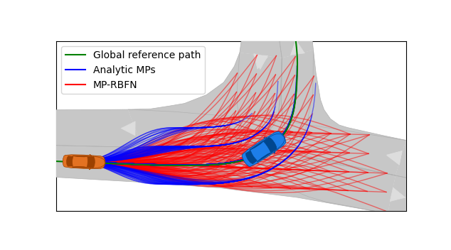
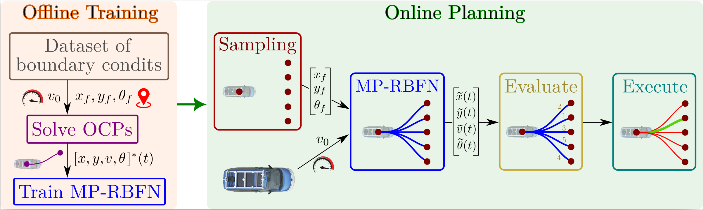
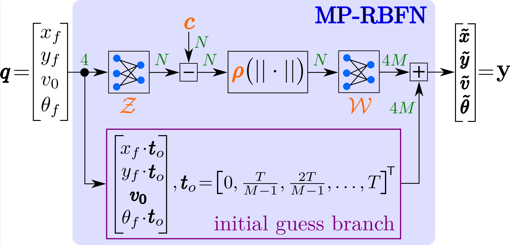
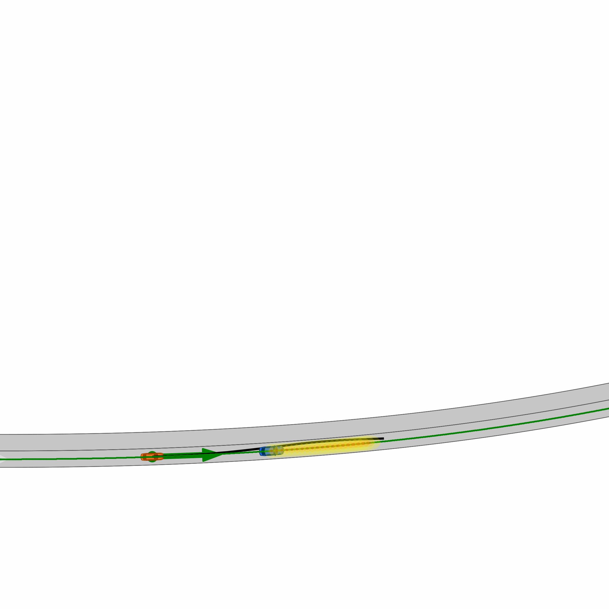

[](https://www.linux.org/)
[](https://www.python.org/downloads/release/python-3110/) 
[](http://perso.crans.org/besson/LICENSE.html)

# MP-RBFN - Radial-basis function based Motion Primitives




MP-RBFN is a neural network based on Radial Basis Function Networks to efficiently learn motion primitives derived from optimal control problems. Traditional optimization-based methods for motion planning show compelling accuracy while being computationally prohibitive. In contrast, sampling-based approaches exhibit high performance but restrict the geometric shape of the trajectories. The proposed MP-RBFN combines the high fidelity of sampling methods with a precise description of vehicle dynamics. We demonstrate superior performance compared to previous methods, achieving a precise description of motion primitives at low inference times. MP-RBFN yields
a seven times higher accuracy in generating optimized motion primitives than existing semi-analytic MPs. The integration into a sampling-based trajectory planner displays the applicability of MP-RBFN-based motion primitives in autonomous driving.

This repository provides the necessary resources to create a vehicle optimal control dataset, train the MP-RBFN and use it in a sampling-based motion planner.

<details>
<summary><h2>🖥️ Framework</h2></summary>
The repository consists of an implementation of an vehicle optimal control problem to generate the dataset of motion primitives. These are then used to train the MP-RBFN. Additionally, a sampling-based motion planner is provided using the trained MP-RBFN to calcualte accurate and computationally efficient motion primitives.





</details>


<details>
<summary><h2>🔧 Requirements & Installation</h2></summary>

### Requirements
The software is developed and tested on recent versions of Linux and Python 3.11. We strongly recommend using [Ubuntu 22.04](https://ubuntu.com/download/desktop) or higher. For the Python installation, we suggest the usage of Virtual Environment with Python 3.12, Python 3.11, or Python 3.10. For the development IDE, we suggest [PyCharm](http://www.jetbrains.com/pycharm/) or [VS Code](https://code.visualstudio.com/)

### 1. **Clone** this repository and create a new virtual environment:
   ```bash
   git clone <repository-url>
   cd <repository-folder>
   ```

   ```bash
   python3.11 -m venv venv
   source venv/bin/activate
   ```

### 2. Install all required packages


#### Installation with pip
You can install the project's requirements using pip:
```bash
pip install -e .
```


### 3. **Optional**: Download additional scenarios [here](https://gitlab.lrz.de/tum-cps/commonroad-scenarios.git).

</details>


<details>
<summary><h2>🚀 Step-by-Step Manual</h2></summary>

All scripts can be found in **scripts**

1. If you want to create a customized dataset, run `run_dataset_creation.py`. The optimal control problem can be adjusted in in `ml_planner.analytic_solution`.

2. For training a model, use `run_training.py`. The different networks are stored in `ml_planner.sampling.networks`.

3. To run a CommonRoad simulation, use the script `run_cr_simulation.py`. The **configurations** for the simulation and the planner can be found in `ml_planner.simulation_interfaces.commonroad_utils.configuration`.


If you want to run the benchmark analysis with the analytical planner, you need to clone and install [Frenetix](https://github.com/TUM-AVS/Frenetix/) within the same virtual environment
</details>


<details>
<summary><h2>🎮 Demonstration</h2></summary>

You probably have to reopen the Readme to see the gifs.




</details>


<details>
<summary> <h2>📈 Test Data </h2> </summary>


Additional scenarios can be found [here](https://commonroad.in.tum.de/scenarios).

</details>


<details>
<summary> <h2>📇 Contact Info </h2> </summary>

[Marc Kaufeld](mailto:marc.kaufeld@tum.de),
Professorship Autonomous Vehicle Systems,
School of Engineering and Design,
Technical University of Munich,
85748 Garching,
Germany

[Mattia Piccinini](mailto:mattia.piccinini@tum.de),
Professorship Autonomous Vehicle Systems,
School of Engineering and Design,
Technical University of Munich,
85748 Garching,
Germany


[Johannes Betz](mailto:johannes.betz@tum.de),
Professorship Autonomous Vehicle Systems,
School of Engineering and Design,
Technical University of Munich,
85748 Garching,
Germany

</details>


<details>
<summary> <h2>📃 Citation </h2> </summary>

If you use this repository in your research, please cite our related papers:


```bibtex
@article{Kaufeld-MPRBFN2025,
      title={MP-RBFN: Learning-based Vehicle Motion Primitives using Radial Basis Function Networks}, 
      author={Marc Kaufeld and Mattia Piccinini and Johannes Betz},
      year={2025},
      eprint={2507.10047},
      archivePrefix={arXiv},
      primaryClass={cs.RO},
      url={https://arxiv.org/abs/2507.10047}, 
}
```


</details>


<details>
<summary> <h2>👥 Code Contributors </h2> </summary>

#### MP-RBFN
[Marc kaufeld](mailto:marc.kaufeld@tum.de)

</details>
